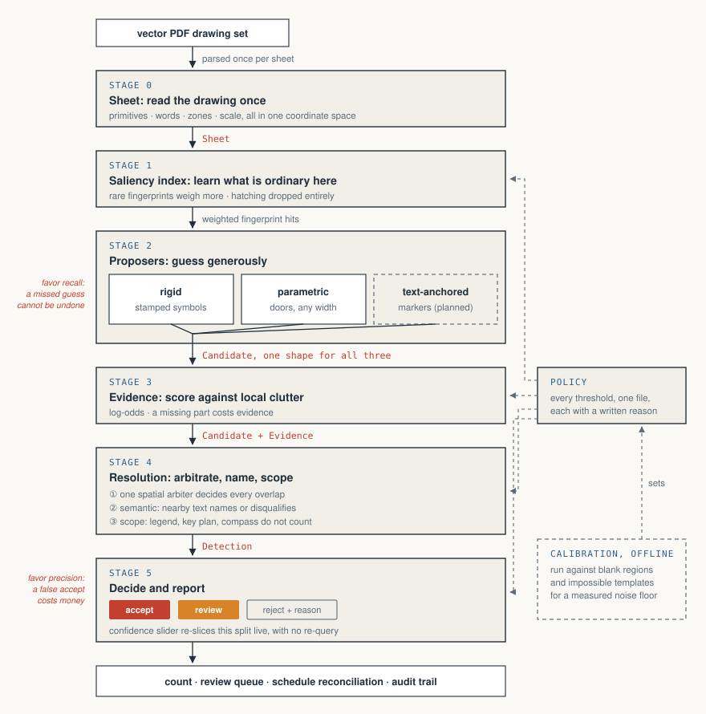

# One-shot symbol detection on construction drawings

Trace one symbol on a drawing and the system finds the rest of them, including the ones
that are rotated, mirrored, drawn at a different size, or half buried under other
linework. Trace a door and it finds doors of every width, and tells you what each one
measures. Or trace nothing at all and let it read the drawing set's own legend, which is
where the symbols were defined in the first place.

There is no training data anywhere in it, and nothing to retrain when a new client's
drawings use different symbols.

## The pipeline



Data flows top to bottom, and the label on each arrow is the actual type in
`pipeline/types.py`. Thresholds come in from the side, out of a single policy file that an
offline calibration run fills in from measured score distributions.

The two red notes in the margin are the reason the pipeline splits where it does. Stage 2
is deliberately trigger-happy, because a candidate it never proposes can't be recovered
later by any amount of cleverness. Stage 5 is deliberately strict, because a wrong count
that looks confident is worse than one that admits doubt. Those want different thresholds,
so they're different stages.

## Run it

```bash
python3 -m venv .venv && .venv/bin/pip install pymupdf numpy scipy flask
.venv/bin/pip install pyobjc-framework-Vision pyobjc-framework-Quartz  # optional, macOS OCR
.venv/bin/python app.py            # http://localhost:8642
```

Drop in any CAD-exported PDF, or use the 28-sheet fit-out set that ships with it. Pick a
sheet, zoom in, drag a box around one symbol. The confidence slider re-slices the results
without re-running anything. The **Auto-count everything via legend** button skips the
tracing entirely.

```bash
.venv/bin/python scripts/demo.py 25       # one sheet, writes an annotated PNG
.venv/bin/python scripts/reconcile.py     # plan counts checked against the panel schedules
```

## Why it's built in stages

A count can be wrong in three ways that have nothing to do with each other, and knowing
which one you're looking at tells you what to fix.

| | The mistake | What fixes it |
|---|---|---|
| **Geometric** | There's no symbol there at all | Better geometry: rarity-weighted votes, evidence measured against clutter |
| **Semantic** | Right shape, wrong type. A GFCI and a duplex receptacle differ by one printed letter | Reading the text tag sitting on the symbol |
| **Scope** | A real symbol that shouldn't be counted: the legend's own example, the key-plan inset, the compass rose | Knowing which part of the sheet you're on |

Lump them together and you get a system that grows another filter every time it's wrong,
until there are three separate rules for what to do about two hits in one spot and nobody
can say which one is authoritative. Splitting them means every failure has somewhere to go.

The other thing that shapes the design: evidence is always weighed against the local
background rather than a fixed number. The same match is worth less inside dense hatching
than out in white space. Without that, a threshold tuned on one sheet is wrong on the next
one.

## Where the ideas came from

Very little of this is original to drawing recognition. The parts that carry the weight
were solved somewhere else first.

The weighting in Stage 1 is inverse document frequency, lifted from text search. A search
engine works out that "the" tells you nothing about a document while a rare word tells you
a great deal, and the same statistic works on geometry if you treat each pair of lines as
a term and the sheet as the document. Wall hatching turns out to be the word "the". On the
sample set a single fingerprint bucket held 15.3% of every line pair on the sheet, and
switching it off cost nothing and removed most of the false matches. (`pipeline/index.py`)

Stage 3 is borrowed from radar. A radar set doesn't measure how much a blip resembles an
aircraft; it measures how much likelier the blip is under "aircraft" than under "noise",
and it sets that threshold by going out and measuring the noise. So the score here is a
log-odds ratio against the local background, and the accept and review cutoffs come from
running the detector across blank paper and against deliberately impossible templates to
see what score pure noise produces. (`pipeline/evidence.py`)

The matching itself is geometric hashing, which was built for comparing protein structures
where the molecule can show up at any orientation. Describe the thing by the relationships
between pairs of its parts, since those survive rotation and scaling, then let every
matching pair vote on where the centre has to be. Handling rotation, mirroring and resizing
falls out of that choice instead of being three special cases, and a symbol with half its
lines buried under a wall still collects enough votes from what's left.
(`pipeline/proposers/rigid.py`)

The output format is stolen from screening radiology, where a computer-aided detection
system is never allowed to just answer. It sorts what it finds into things it's confident
about and things a radiologist needs to look at, because missing a tumour and crying wolf
are not equally bad mistakes. Stage 5 does the same with three buckets: accept, review, and
reject with the reason attached. What comes out is a work list rather than a number.
(`pipeline/resolve.py`)

## What falls out of the design

**Read the drawing's own dictionary.** Every set ships a legend defining its symbols. This
harvests those glyphs along with their printed names and counts them, so an unfamiliar
firm's symbology works immediately and nobody labels anything.

**Handle symbols that aren't copies of each other.** A 3'-0" door and a 2'-6" door are
genuinely different geometry, not the same picture at two sizes. Tracing any door switches
to a structural detector that looks for an arc with a leaf hinged at its centre, finds
every width, and reports the width of each, since the arc radius *is* the door width.

**Check its own answer.** A drawing set states its quantities twice, once as symbols on the
plan and once as schedules. `scripts/reconcile.py` counts receptacles on the plan, OCRs the
panel schedule tables, and reports where the two agree, room by room. It is the check a
human estimator does by hand before trusting a number.

**Say how sure it is, and why.** Every detection carries its evidence score, so the
confidence slider filters results that were already scored instead of changing what the
algorithm looks for.

## Measured on the included set

| | |
|---|---|
| Stage 1 occurrence filter | switched off 1 fingerprint bucket holding **15.3%** of all line pairs, the wall hatching |
| E4 receptacles | **163 confident, 23 flagged** for review |
| Doors per sheet | **35**, up from 26 before the hinge-dedupe fix |
| Cross-sheet check | T5 and T8 both give **33** standard doors, and E4 agrees independently |
| Reconciliation | **22 rooms corroborated**, 12 flagged, 0 contradicted |
| Query latency | 0.4 to 2 seconds per trace on a sheet with 33,000 primitives |

That door number moved late and the reason is worth knowing. A duplicate-removal rule was
treating any two hinges within half a door width of each other as the same door, and
back-to-back office doors hang off a shared jamb about 12pt apart. So every pair along the
corridor was counted once instead of twice: nine doors a sheet, quietly gone. Nothing about
the total looked wrong, which is the uncomfortable part. It took someone pointing at two
specific offices on screen to catch it.

## Honest limits

**Vector PDFs only.** Scanned drawings have no geometry to read and the app says so on
upload rather than returning nothing. A raster fallback is worked out in `METHOD.md` but
not built. If scans matter, a learned detector is the right tool for that path, and it
would slot into Stage 2 as a fourth proposer, inheriting the same evidence scoring,
arbitration and reconciliation as the rest.

**No accuracy figures.** The thresholds come from measured score distributions, not from
hand-counted ground truth, so there's no honest precision or recall number to quote per
class. Building that evaluation set is the most useful next thing to do.

**Two of the four classes in the assignment.** Doors and receptacles work. Detail markers
and elevation markers have a designed home in `TextAnchoredProposer`, which is currently a
stub.

**Near-identical variants still bleed into each other** during legend auto-count, where the
line-pattern legend entries match ordinary wall linework. Splitting subclasses is the next
piece of Stage 4.

It also assumes English legend headings, imperial scale notes, and legends laid out in
columns.

## Reading the code

Start with the diagram, then go in this order. It's about 700 lines.

| File | What it is |
|---|---|
| `pipeline/__init__.py` | The map: the stages, and why they're divided that way |
| `pipeline/types.py` | The five objects that move between stages |
| `pipeline/policy.py` | Every threshold in the system, each with the measurement behind it |
| `pipeline/sheet.py` | **Stage 0**, read each sheet once into one coordinate space |
| `pipeline/index.py` | **Stage 1**, work out which shapes are rare on this sheet |
| `pipeline/proposers/` | **Stage 2**, three ways of generating guesses |
| `pipeline/evidence.py` | **Stage 3**, score every guess on one comparable scale |
| `pipeline/resolve.py` | **Stage 4**, arbitrate, name, scope |
| `pipeline/api.py` | What `app.py` actually calls |

```
app.py              web server and request handling
web/index.html      the UI
pipeline/           the architecture above     <- read this
oneshot/            the earlier engine, kept as a baseline to compare against
scripts/            demo, reconciliation, exemplar discovery
docs/               pipeline diagram
METHOD.md           research basis and the academic lineage
```
